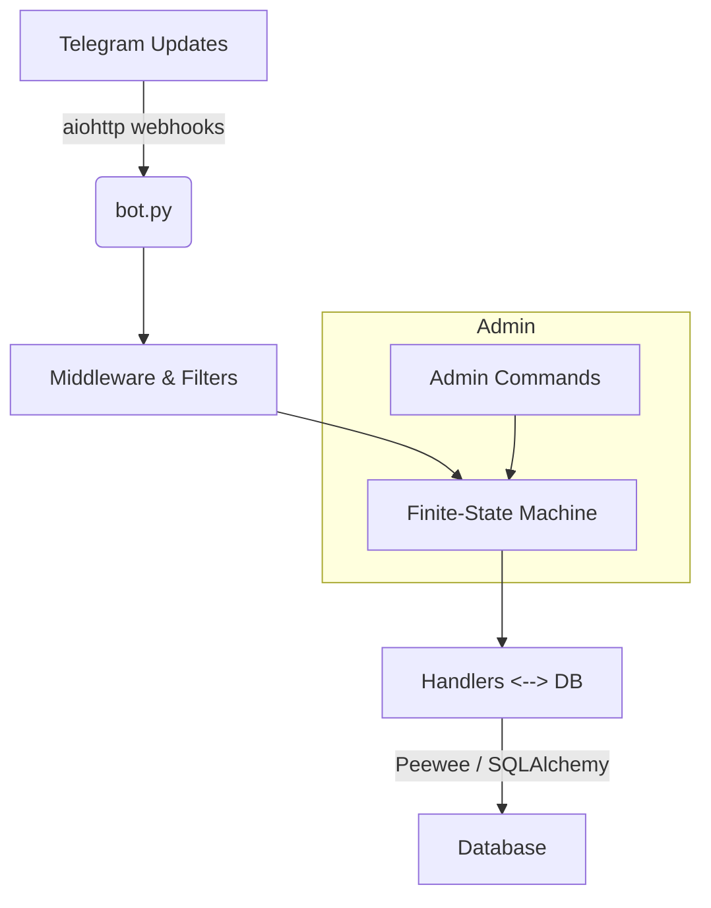

# 🧩 FlowQuest Engine — A Scalable Async Quest Engine for Telegram

**FlowQuest Engine** turns Telegram into an interactive game platform.  
Built on *aiogram 3*, it handles **10 000+ concurrent updates** on a laptop, lets authors design branching text adventures, and gives admins full control over quests, users, and in-game rewards.

---

## 🚀 Key Features

| Feature                                  | What It Brings                                                      |
|------------------------------------------|---------------------------------------------------------------------|
| **High-load async core**                 | >10 k concurrent requests without sharding                          |
| **Modular, SOLID codebase**              | Clear separation of concerns (handlers, FSM, DB, utils)             |
| **Finite-State Machine engine**          | Precise tracking of multi-step quest flows                          |
| **Admin dashboard**                      | Create, edit, publish, delete quests; manage user XP, coins, bans    |
| **ORM + migrations**                     | Swap SQLite ↔ PostgreSQL in minutes                                  |
| **Plug-and-play design**                 | Re-use the engine for polls, micro-learning, FAQ bots, etc.         |

---

## 🏗️ Architecture Overview


---

## 📂 Project Layout

core/  
├── handlers/      # user & admin flows  
├── keyboards/     # inline / reply layouts  
├── states/        # FSM definitions  
├── db/            # models & migrations  
└── utils/         # helpers, rate limits, logging  
bot.py             # entry point  

---

## ⏱ Benchmark

| Metric               | Value (AWS t3.small) |
| -------------------- | -------------------- |
| Requests-per-second  | 2 000 updates/s      |
| Peak concurrency     | 12 400 tasks         |
| Avg. handler latency | < 40 ms              |

---

## 🛠 Tech Stack

| Layer         | Tools / Libraries                  |
| ------------- | ---------------------------------- |
| Language      | Python 3.12 + asyncio              |
| Telegram API  | aiogram 3                          |
| State Machine | aiogram FSM                        |
| Database      | Peewee 2 • SQLite (default)        |
| Deployment    | Docker-ready, GitHub Actions CI    |

---

## ⚡ Quick Start

```git clone https://github.com/jrwdev/FlowQuestEngine.git```   
```cd FlowQuestEngine```  
```python -m venv venv && source venv/bin/activate```  
```# Windows: venv\Scripts\activate```  
```pip install -r requirements.txt```  

Fill in ```configdata``` file with bot token and admin id  

```python bot.py```  

---

## 🌍 Why FlowQuest Engine Matters

Gamification shouldn’t be hard.  
With QuestForge one engineer can launch a production-grade platform that survives a viral TikTok spike yet remains extensible for training, surveys, or customer-support chatbots.

---

## 📜 License

MIT — fork it, star it, and build something awesome.